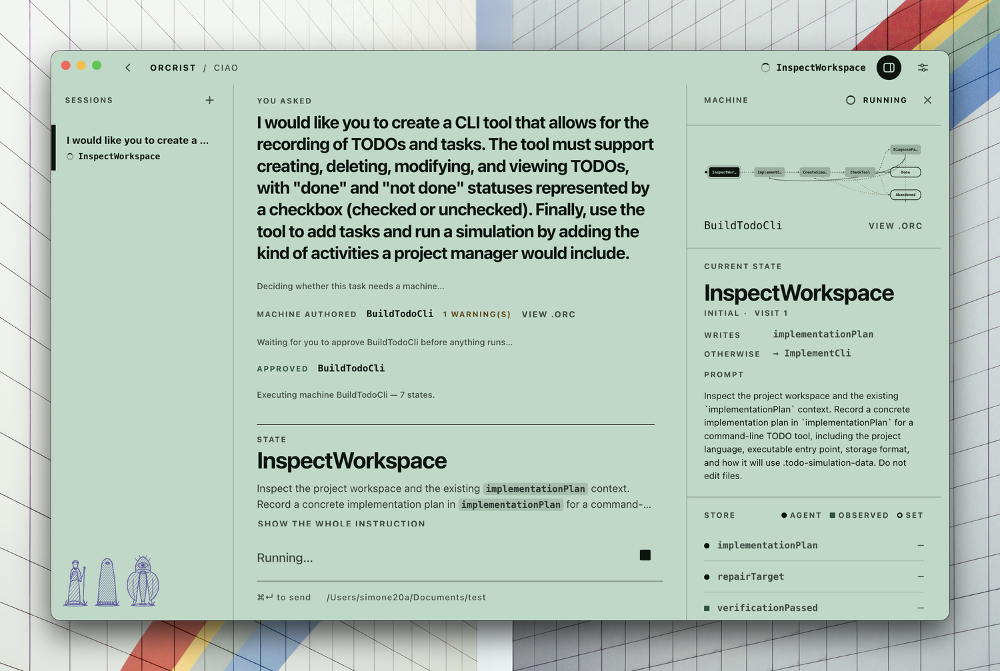
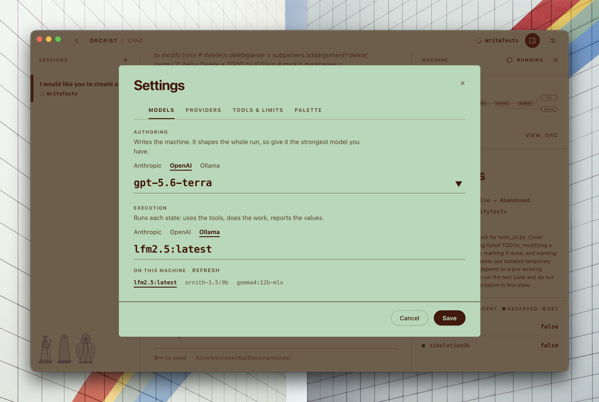

<p align="center">
  
</p>

**Orcrist** is a DSL for state machines whose states are executed by an LLM, and a desktop coding agent that runs on it.

You give the agent a task. Before touching anything it writes an Orcrist machine for that task, grounded in the grammar and the authoring guide in this repo, and then executes that machine one state at a time. Each state's prompt goes to the model, the model works with real tools, the runtime measures what it can and records what the state is declared to report, and the machine's guards decide what happens next. The run ends when it reaches a `final` state.

The point is the one the authoring guide makes: a to-do list only contains what was explicitly asked for, and has no answer for what happens when a step doesn't go as planned. A machine has to declare its failure paths, its retry budgets and its escalation states before the work starts.



*A run in progress. The transcript carries the states as they happen; the panel on the right holds the machine, the state now executing with the instruction it was given, and the store, with each location marked by who writes it: the agent, a measurement, or a `set`.*

---

## What's in here

```
orcrist/
├── metamodel/
│   ├── orcrist.langium        the grammar, ground truth for the authoring step
│   └── authoring-guide.md     the criteria the authoring model is told to follow
├── examples/*.orc             canonical syntax, shown to the authoring model
├── src/                       the app: core, language implementation, renderer
├── electron/                  the main process and the preload bridge
├── scripts/                   the self-test
├── prompts/                   project prompts to run the agent against
├── brand/                     the mark, the lockup, the icons
├── screens/                   the screenshots in this README
└── docs/                      how the app works, in depth
```

The grammar, the guide and the examples are read **at runtime**, not compiled in: the app walks up from its own folder until it finds `metamodel/orcrist.langium`. Editing the language therefore changes what the authoring step is grounded in without rebuilding anything, and a checkout with `metamodel/` missing has nothing to author machines against.

## Requirements

- **Node 20 or newer**, with npm
- macOS, Linux or Windows
- An API key for Anthropic or OpenAI, **or** a local [Ollama](https://ollama.com) with a model that supports tool calling

## Install

```bash
git clone <this repo>
cd orcrist
npm install
```

`npm install` downloads the Electron binary in a postinstall step. If that step fails (see [Troubleshooting](#troubleshooting)), the rest still installs, and `npm test` and `npm run build` work without it.

## Run

```bash
npm start
```

That compiles the main process, bundles the renderer and launches the app. For iterative work:

```bash
npm run dev
```

which runs the Vite dev server with hot reload and points Electron at it.

## Build

```bash
npm run build          # both halves
npm run build:main     # main process + core, via tsc
npm run build:renderer # renderer, via Vite
```

Output goes to `dist/`: `dist/main/` for the Electron side, `dist/renderer/` for the UI. There is no packaging step yet; `npm start` runs the built app in place.

## Test

```bash
npm test
```

This parses and validates every `.orc` in `examples/`, checks that a set of deliberately broken machines is rejected for the right reasons, runs a machine end to end against a scripted mock provider, and checks the things a real run depends on: that cancelling a run actually stops the request, that a measured value beats a model's claim, that a state restricted to no tools is handed none, and that the store travels with every state instruction.

It needs no API key and makes no network calls.

## First run

1. Open **Settings → Providers** and put in an API key. For Ollama there is no key: the models installed on the machine are listed for you under whichever role you point at it.
2. In **Settings → Models**, choose the two models. They are separate roles:
   - **Authoring** writes the machine. Give it the strongest model you have, because it decides the shape of the whole run, what counts as proof that each part works, and what each state is allowed to touch.
   - **Execution** runs each state. This is where a smaller or local model is affordable, because the machine is what supplies the structure it would otherwise have to hold in its head.
3. Create a project. A project is a name plus a workspace folder; every shell command and file operation is sandboxed to that folder, and the session history lives inside it under `.orcrist-agent/`.
4. Send a task.



*The two roles, set separately. Point one at Ollama and the models installed on the machine are listed underneath it, and clicking one uses it.*

**Settings → Palette** changes the whole app's colours. Six palettes ship; each is six seed colours and everything else is derived from them.

## Troubleshooting

**"Electron failed to install correctly."** The postinstall download failed on its own (a network hiccup, a proxy, a GitHub rate limit) while the rest of the install reported success. The symptom is `node_modules/electron/` with no `dist/` inside. Re-run just that step:

```bash
npm run fix:electron
```

If it fails again the error says why. Behind a proxy, set `HTTPS_PROXY` and retry. If GitHub is unreachable or rate-limiting, use a mirror:

```bash
ELECTRON_MIRROR="https://npmmirror.com/mirrors/electron/" npm run fix:electron
```

**"Could not find metamodel/orcrist.langium."** `metamodel/` is missing from the checkout, or the app was copied somewhere on its own. It looks up the folder chain from its own location, so `metamodel/` and `examples/` belong at the root of the repo, beside `package.json`.

**A run stops at "no machine for this message".** The authoring model decided the task is a single question with no process in it, and said so rather than wrapping one step in ceremony. The reason is printed in the transcript.

## Going deeper

| document | what it covers |
| --- | --- |
| [`docs/how-it-works.md`](docs/how-it-works.md) | how the app works: the authoring loop, the state boundary, claims versus measurements, the tools, the type scale and the palette system |
| [`metamodel/authoring-guide.md`](metamodel/authoring-guide.md) | how to turn a prompt into a machine: the document the authoring model is given verbatim |
| [`metamodel/orcrist.langium`](metamodel/orcrist.langium) | the grammar, and the list of constraints the validator enforces on top of it |
| [`brand/README.md`](brand/README.md) | the mark: why those six colours, and which file to use where |
