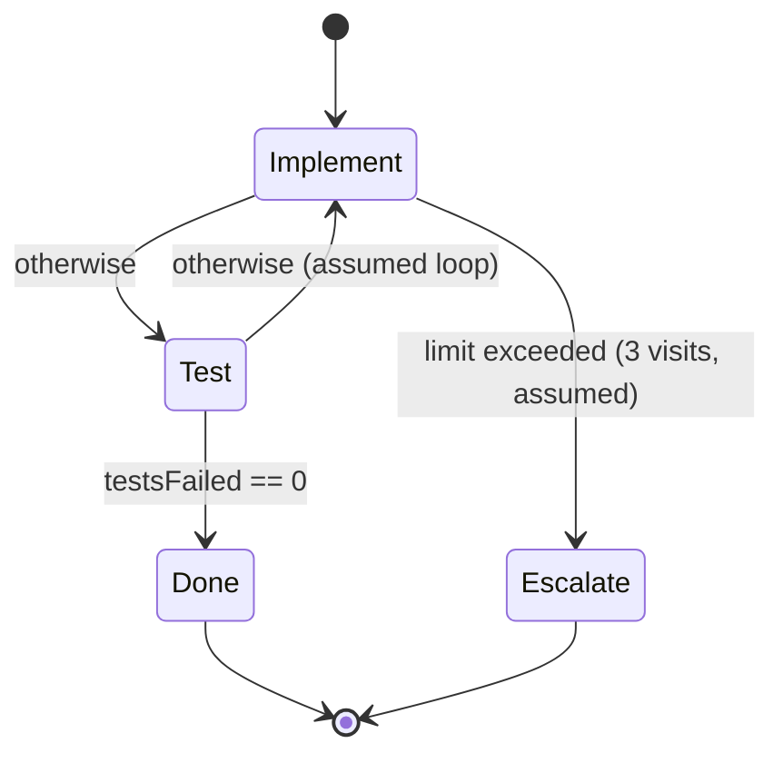
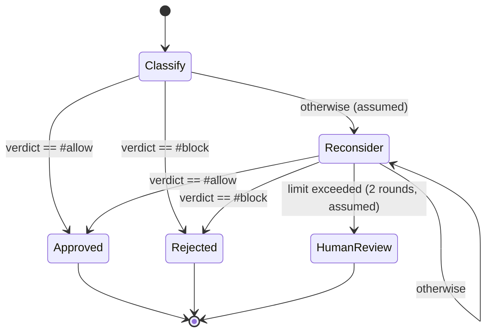
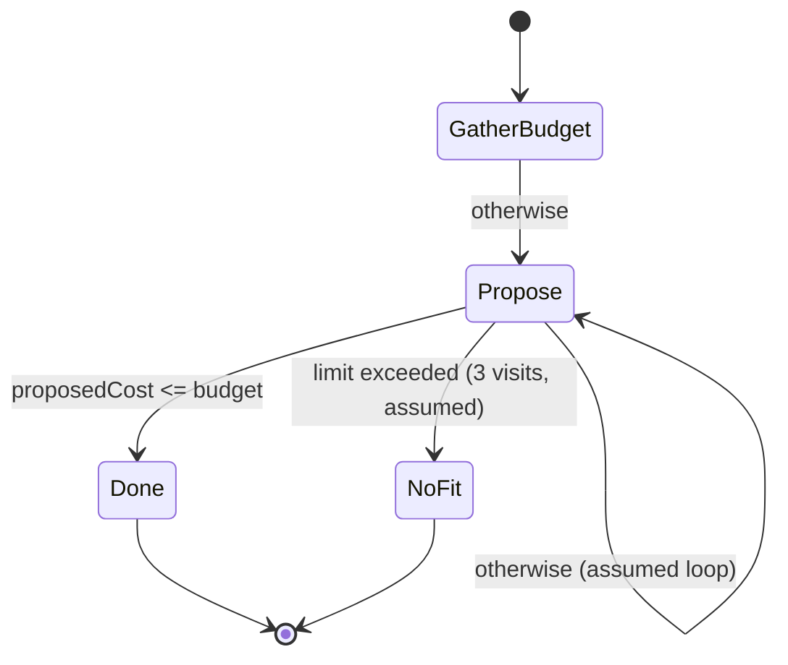

# Orcrist Authoring Guide — Turning a Prompt into a State Machine

## Purpose

This document is written for an LLM (or an LLM-driven agent) that, given a natural-language task prompt, must produce a valid Orcrist model instead of a flat to-do list. It is a set of authoring criteria and a step-by-step procedure, not a syntax reference — the syntax itself is defined by `orcrist.langium` in this same folder, and should be treated as ground truth over anything stated here.

Orcrist forces every model to make an explicit choice, for every piece of state, between two categories: values the LLM reports about itself while doing the work (`agent`-owned locations) and values that are computed deterministically by the runtime from the store (assignable locations, written only through `set`). The single most consequential decision when authoring a model is *where each fact you need belongs* in that split. Everything below exists to help make that decision well, and to make sure the resulting machine is finite, terminating, and free of dead ends — properties the grammar makes structurally hard to violate, but easy to violate in spirit if the model is authored carelessly.

## 1. Extract the shape of the process from the prompt, before writing anything

Read the incoming prompt and answer these questions explicitly (in scratch notes, not necessarily in the model) before touching syntax:

- What does "done" mean, and are there multiple distinct ways of being done (success, failure, abandoned, escalated)? Each becomes a `final` state.
- What is the single entry point? Exactly one state should be `initial`.
- What are the distinct phases of work the process moves through? Each becomes an active `state`.
- What information has to persist across phases in order to decide what happens next? Each becomes a `Location`.
- For every one of those locations: could a system outside the LLM's own claim compute or verify this value (a test run, a count, a comparison, a fixed policy)? If yes, it must be assignable, not `agent`. If the value is inherently a judgment, a piece of free text, or a choice that only the LLM performing that step can produce, it is `agent`-owned — but that also means any guard reading it is only ever a self-report, never a checked fact.

Do not let the state list default to mirroring a to-do list's items one-for-one. A to-do item ("run the tests") is an action; a state in Orcrist is a point where the machine pauses, asks the LLM something specific through a prompt, and then a decision is made from the resulting store. If two to-do items always happen together and nothing branches between them, they can be one state, not two.

Most real prompts will not answer all of the questions above explicitly — they state an intent and leave the failure paths, retry budgets, and escalation logic unsaid. That is the normal case, not an exception, and it does not excuse a thinner model. See section 11 for how to derive that structure anyway.

## 1.1 Decompose the prompt into sub-tasks — the sub-tasks are the states

The prompt arrives as one large problem. Do not try to model it as one. Before anything else, break it into the smallest set of sub-tasks that together accomplish it, and write that list down. **That list is the state list.** One sub-task, one active state; the machine is the decomposition, made executable.

This is not a formatting convention. It is the mechanism by which the whole approach works, for two reasons.

The first is that the model executing the machine is given **one state at a time** and nothing else — its instruction, and the names of the states that may come next. It never sees the prompt you were given, and it cannot see the other states' instructions. So a sub-task that is too large is a sub-task the executing model has to solve in one turn, unaided, with the whole original problem's difficulty still in it. Decomposition is what converts a problem too big to get right into a sequence of problems each small enough to get right. If the decomposition is poor, no amount of good syntax downstream recovers it.

The second is that the boundaries between sub-tasks are the only places the machine can do anything at all. Between two states the runtime reads the store, evaluates guards, and chooses; *inside* a state it has no view and no vote. Every decision the process is capable of making lives on a boundary you drew.

### Where to put the boundaries

The test for a boundary is a single question: **what does the machine know at the end of this sub-task that it did not know at the start, and does anything branch on it?**

- If the answer is "a value gets reported and a guard reads it", the boundary is real. That is a sub-task.
- If the answer is "nothing is reported and nothing branches", the boundary is imaginary. Merge it with its neighbour — you have split a sub-task into two states that always run one after the other, which buys nothing and costs the executing model the context of half its own job.
- If a single sub-task would report two unrelated facts that are used at two different decision points, it is two sub-tasks.

This is the point section 1 makes about to-do items, stated positively. "Run the tests" and "report how many failed" are not two sub-tasks — the second is how the first ends. But "implement the change" and "run the tests" *are* two, because between them sits a fact the machine needs and a decision that depends on it, and because the executing model must not do the second while it is doing the first.

### What a well-formed sub-task looks like

- **It stands alone.** Its prompt has to be comprehensible to someone who sees only that prompt. "As discussed above", "if the previous step failed", "continue where you left off" all refer to something the executing model cannot read. Anything an earlier sub-task discovered reaches a later one only through the store, which is what interpolation (`<location>`) is for.
- **It has one verb.** Design, or implement, or measure, or document — not "implement and verify". A sub-task with an "and" in its description is usually two, and the prompt of such a state instructs the executing model to cross a boundary you meant to draw.
- **It ends in something recordable.** Either it reports a value (`writes`), or it produces an artefact a later sub-task will read from disk. A sub-task that ends in neither has not changed the machine's world and probably does not exist.
- **It is describable in two sentences.** If describing it honestly takes a paragraph, it is carrying more than one job.

Three to seven sub-tasks is the usual range for a real task. Fewer usually means the decomposition stopped too early and one state is hiding an entire problem inside it; more usually means to-do items got promoted to states one-for-one, against section 1's warning.

### Write the decomposition before the syntax

Produce the list first, in plain prose, as a table of *sub-task → what it produces → what is decided afterwards*:

| # | Sub-task | Produces | Decision that follows |
|---|----------|----------|-----------------------|
| 1 | Reproduce the reported bug and record whether it reproduces | `reproduced` (agent) | reproduced? continue : report back as not-reproducible |
| 2 | Locate the cause and write it down | `diagnosis` (agent) | none — always continue |
| 3 | Apply the fix | — | none — always continue |
| 4 | Run the suite and report the failure count | `failuresRaw` (agent) → `failures` (assignable) | zero? done : back to sub-task 3, bounded |

Only once that table is right does it become states, locations and guards. The fourth column is where the `transitions` come from, the third is where the `locations` come from, and a row whose fourth column reads "none" for every sub-task is a warning that the process has no decisions in it and may not need a machine at all (see section 11's closing point, and the `NO_MACHINE` answer).

## 2. Design the ownership split deliberately

Every location is written by exactly one of three parties, and the mode you choose decides what a guard reading it is actually testing:

| mode | written by | a guard reading it tests |
| --- | --- | --- |
| `agent` | the LLM, through `writes` | what the model **claimed** |
| `observed` | an `observe` clause, run by the runtime | what the **world did** |
| assignable (unmarked) | `set`, evaluated by the runtime | a value **derived** from the store |

- Default to assignable. Mark a location `agent` only when nothing but the LLM's judgment at that point can produce the value — a design choice, a summary, a name for what went wrong.
- **Where a command can settle the question, prefer `observed` to `agent`.** A state that says "run the tests and report the number that failed" produces a number the model chose to type. `observe failures from "npm test 2>&1 | grep -c '^not ok'"` produces the number the suite printed. The first is a claim and the second is a measurement, and the difference matters most precisely where the guard matters most: the check that decides whether the run is finished. A model that is confused, optimistic, or simply out of context will report success; the shell will not.
- An `observe` clause runs after the state's turn and before its `set` assignments, so the derived values a guard reads are computed from what was just measured. Its shape:

  ```
  observe failures from "npm test" matching "(\\d+) failing" else 99;
  observe builds from "cargo build";
  ```

  With a `matching` pattern the first capture group is converted to the location's type; with no pattern the command's exit code is used — as a `Bool` it is true when the command succeeded, as a number it is the exit code itself. `else` supplies the value to use when the command fails to run or nothing matches, and like every default it should be the pessimistic one (see the last bullet).
- Keep `agent` for what the model is genuinely the only source of, `observed` for anything with an exit code or a printable number, and let `set` combine them. A useful pattern is to have the state ask for the model's account *and* measure the same fact, then branch on the measurement — the claim is still worth recording, because a run where the two disagree is the interesting one.
- Never let a transition that gates something safety- or correctness-critical ("did the tests actually pass", "is the spend within budget") depend on an `agent`-owned location when an `observed` one is possible. Where no command can settle it, keep the untrusted surface small and clearly labelled: the LLM writes a raw value into an `agent` location and the load-bearing guard reads an assignable location that a `set` derives from it.
- Remember that `set` assignments can only recompute a value from literals and the *current* store — the grammar's `Expr` has no side-effecting primitives. An assignment is a pure re-derivation. The way a fact about the outside world enters the store is `writes` (the model reports it) or `observe` (the runtime measures it); never write a `set` that quietly assumes an external computation happened.
- A location's frame at any given state is exactly `writes`, plus the targets of that state's `observe` clauses, plus the targets of its `set` assignments. Every `agent`-owned location the prompt is expected to fill in must be listed in `writes`; don't rely on the LLM writing to a location that isn't declared there.
- **Defaults are claims too.** A location's initial value is what a guard reads before anything has measured it, so give it the worst case: a failure count starts at its maximum, not at zero, and a "build succeeded" flag starts false. A store that opens on "the check passed" will wave a run through a check that never ran.

## 2.1 Restrict a state's tools when the state's job is narrow

A state may declare which tools its turn is allowed to use:

```
tools run_command, read_file;
tools none;
```

With no `tools` clause the state gets everything. The clause is how a boundary drawn in the prompt is made real rather than merely requested: a check state that says "run the suite and fix nothing" is one sentence away from a model that fixes something anyway, whereas a check state with `tools run_command, read_file` *cannot* write a file. Use it where the prompt already contains a prohibition — the checking half of every build/check pair, an adjudicator whose job is to name a culprit and change no code, a state that only decides and records. `tools none` suits a state whose whole output is a judgment: the model reads what it was given, reports, and can touch nothing.

Do not use it to micro-manage a building state. A state that has to implement something needs the whole toolbox, and guessing at a subset there produces a run that fails for a reason that has nothing to do with the task.

## 3. Keep types finite and as narrow as possible

- Bound every `Int`/`Nat` location with `[lower..upper]` whenever the domain has a natural bound (retry counts, percentages, small tallies). Unbounded numeric ranges defeat the model-checking the bounds exist to enable.
- Prefer `EnumType` (`{ ... }`) over free `Text` whenever the set of legal values is closed — it turns an open-ended guard ("is the outcome roughly positive?") into an exact comparison.
- Use `record` types to group related fields that are always read and written together (e.g. `tests: record { passed: Nat[0..100], failed: Nat[0..100] }`), and address individual fields with a path (`tests.failed`) rather than inventing separate flat locations that have to be kept in sync by hand.
- Reserve `Text` and `File` for content that is genuinely free-form and is never itself the subject of a guard — if you find yourself wanting to branch on the content of a `Text` location, that is a sign it should have been an `Enum` or a `Bool`.

## 4. Every active state needs a prompt, and every active state needs an honest fallback

The grammar requires `prompt` and `otherwise` on every non-final state — there is no way to author a state with no way out. Use that requirement well rather than satisfying it mechanically:

- The prompt should be self-contained: it should only interpolate (`<location.path>`) values that are guaranteed to already be set on every path that can reach this state. Don't interpolate a location that is only written in a branch that might not have been taken.
- `otherwise` is the catch-all when none of the explicit `on <guard> ->` transitions fire. Design it as the meaningful default outcome for that state (retry, escalate, ask again, fail safe) — not as an afterthought or an error dump. If you find yourself wanting `otherwise` to cover a case you can actually name and check for, write it as an explicit guarded transition instead and keep `otherwise` for the genuinely unanticipated remainder.

## 5. Guards, determinism, and loops

- Prefer guards written over assignable locations. A guard over an `agent`-owned location is only ever asking "what did the LLM claim," which is fine for genuinely subjective branching but should not be the only thing standing between the process and an unsafe or incorrect outcome.
- Keep the guards leaving a single state mutually exclusive where feasible. The grammar does not prevent writing two transitions whose guards can both be true at once, which makes the model's behavior at that point ambiguous (the very determinism concern the validator is meant to check). When two conditions can overlap, order them so the more specific one is checked as an explicit guard and let `otherwise` (or a wider guard) absorb the remainder, rather than writing two guards that can both match.
- Loops (a transition back to an earlier state — e.g. "retry the implementation") are expected and idiomatic. Any state that participates in a loop must carry a `limit` (`limit visits <= N else -> <state>`) so the model is structurally guaranteed to terminate rather than relying on the LLM to eventually stop looping. Choose `onExceeded` to point at a meaningful escalation or failure state, not back into the loop.

## 6. Check reachability and totality before considering the model done

Once the state and transition list is drafted, verify by hand (the validator will check this formally, but do it yourself while authoring):

- Every declared state is reachable from `initial`.
- Every non-final state has, for every combination of relevant guard values, at least one outgoing transition that fires — `otherwise` guarantees this syntactically, but check that the specific guarded transitions plus `otherwise` actually reflect the intended behavior of the process, not just "well-formedness."
- From every state, there exists some path to a `final` state (no state should be a live loop with no exit other than a `limit` escape that itself leads back into more looping).

## 7. Invariants describe the world, not the LLM's opinion of it

Machine-level `invariant`s are only meaningful over data you trust as ground truth. Write invariants over assignable and `observed` locations (and bounded/enum-typed ones especially, since those are what make an invariant checkable over a finite state space). An invariant phrased over an `agent`-owned location is really an assumption about what the LLM will claim, not a property of the world — don't rely on it to express something that must actually hold.

## 8. Minimal illustrative skeleton

This is not a copy of an existing example — it is a skeleton built directly from the grammar to show the shape described above. Treat any `.orc` files under `examples/` (referenced in the trailing comment of `orcrist.langium`, if present in this project) as the canonical syntax reference once they exist.

```
machine ExampleProcess {

    locations {
        attempt: Nat[0..5] = 0
        verdict: { pass, fail }
        agent summary: Text
    }

    invariant attempt <= 5;

    initial state Start {
        writes summary;
        prompt: "Begin the task. Describe your plan."
        set attempt = 0;
        on true -> Work;
        otherwise -> Work;
    }

    state Work {
        writes summary;
        prompt: "Attempt the task. Report what happened in " <summary> ".";
        set attempt = attempt + 1;
        limit visits <= 5 else -> Escalate;
        on verdict == #pass -> Done;
        on attempt >= 5 -> Escalate;
        otherwise -> Work;
    }

    final state Done {}

    final state Escalate {}
}
```

Note that `verdict` here is left deliberately unassigned by anything in this skeleton on purpose — in a real model, decide explicitly whether it is `agent`-owned (the LLM reports its own verdict), `observed` (a command measures it), or assignable (something else computes it and `set`s it), and write the corresponding `writes`, `observe` or `set` accordingly; leaving that ambiguous is exactly the mistake this guide exists to prevent.

### 8.1 The measured build/check pair

The same skeleton with the check state measured rather than reported. `failures` opens at its maximum, the check state cannot edit a file, and the guard that ends the run reads a number the test runner printed:

```
locations {
    observed failures: Nat[0..200] = 200;
    agent note: Text;
}

state Implement {
    prompt: "Make the change described in " <spec> ". Do not run the tests — the next state does that.";
    limit visits <= 4 else -> Abandoned;
    otherwise -> Check;
}

state Check {
    writes note;
    tools run_command, read_file;
    prompt: "Run the test suite and summarise what failed in " <note> ". Fix nothing.";
    observe failures from "npm test 2>&1 | grep -c '^not ok'" else 200;
    on failures == 0 -> Done;
    otherwise -> Implement;
}
```

## 9. Common pitfalls to avoid

- Gating an important transition on an `agent`-owned location when a command could have measured the same fact into an `observed` one.
- An `observed` location that starts at zero, or a `matching` pattern with no capture group: the first waves through a check that never ran, the second can never produce a value.
- `tools` on a state that has to build something, so the state is denied the very tool its instruction requires.
- Unbounded `Int` locations that make the model impossible to model-check.
- A loop with no `limit`.
- `writes` that don't match what the prompt actually asks the LLM to produce.
- Guards on different outgoing transitions from the same state that can be true simultaneously.
- Treating `otherwise` as a place to hide a case that should have been an explicit, named guard.
- An invariant written over `agent`-owned data, stated as if it were a fact rather than a claim.

## 10. Suggested authoring order

0. Decompose the prompt into sub-tasks and write the table from section 1.1. Everything below is derived from it.
1. List terminal outcomes → `final` states.
2. Take the sub-tasks from step 0 → active states, with one `initial`.
3. List the facts that need to persist → `Location`s, each explicitly classified `agent` vs assignable, each typed as narrowly as possible.
4. For each active state: write the `prompt`, the `writes`, the `assignments`, then the guarded `transitions`, then `otherwise`.
5. Add `limit` to every state that participates in a loop.
6. Add machine-level `invariant`s over assignable data.
7. Walk the graph by hand: check reachability from `initial`, totality of every active state, and that every guard set is unambiguous.

## 11. When the prompt doesn't spell out the structure

Most real prompts are not exhaustive process specifications — they state an intent ("triage this bug report", "review a pull request", "plan a trip within budget") and leave the actual states, loops, retries and escalation paths unstated. This is the normal case, not an edge case, and Orcrist's structural requirements (`prompt` and `otherwise` on every active state, `limit` on every loop) do not go away just because the prompt didn't ask for them explicitly. Producing a machine with a single state that goes straight to `Done` is not "being faithful to what was asked" — it is failing to do the part of the job that was actually delegated: turning intent into a complete, terminating process.

Treat every underspecified prompt as asking you to supply, from domain convention and from what the grammar itself requires, the structure a competent practitioner in that domain would use even though nobody wrote it down:

- If the task is the kind of thing that can plausibly fail, be rejected, or come back incomplete (a review, a test run, a build, a classification with a "not sure" outcome), assume there is a failure or revision path even if the prompt only describes the happy path, and model it as a loop guarded by a `limit` rather than leaving the process able to succeed only exactly once.
- If the task has a natural notion of "good enough to stop trying" (a budget, an attempt count, a deadline, a confidence bar), invent a bound for it — a small, reasonable default (three attempts, not thirty) — even if the prompt gives no number, rather than leaving a location unbounded or a loop unlimited.
- If the task involves a judgment a reasonable process would want a second, escalated opinion on (something high-stakes, ambiguous, or repeatedly failing), add the escalation state and the `limit` that leads to it, rather than looping forever or forcing the same decision indefinitely.
- Distinguish what the prompt actually decided from what you filled in. Anything added that was not asked for — a retry loop, a bound, an escalation path, an intermediate state — should be flagged with a short comment near the location or state it affects, e.g. `// assumed: cap re-review at 3 rounds, prompt did not specify`, so a human reviewing the model later can see where judgment was exercised versus where the prompt was followed directly.
- Do not invent branches or states that add complexity without being load-bearing for termination, ownership, or the prompt's actual intent — filling in structure is not license to over-model. The test is the same one from section 6: does every non-final state have a real reason to exist and a real path onward, not "did I use every construct the language offers."

This is, in effect, the same posture that makes a to-do-list harness weaker than Orcrist in the first place: a to-do list only ever contains what was explicitly asked for, and quietly has no answer for what happens when a step doesn't go as planned. An Orcrist model authored well does not have that gap — even when the prompt itself does.
## 12. Worked examples: deriving structure from a thin prompt

Three prompts, none of which mention a retry, a bound, or an escalation path — illustrating section 11 rather than section 2's ownership skeleton. Anything below that the prompt did not ask for is marked `// assumed:`, so the judgment calls stay visible instead of getting silently absorbed into the model.

### 12.1 "Implement the feature and make sure it works."

Added: a retry loop between implementing and testing (the prompt only describes success); a `limit` of 3 attempts (no number was given); an `Escalate` final state (the prompt never said what should happen if it still doesn't work after reasonable effort); a 0..50 bound on the failing-test count (an arbitrary but finite scale, since none was given).

Deliberately *not* added: a separate spec-writing state (present in `examples/ciclo-sviluppo.orc`, whose prompt was more explicit). Nothing here needs one to terminate or to resolve ownership, so per the last bullet of section 11 it would be unrequested elaboration, not filled-in structure.

```
machine ImplementAndVerify {

    locations {
        agent testsFailedRaw: Nat[0..50]; // assumed: bound, scale unstated
        testsFailed: Nat[0..50] = 0;
    }

    initial state Implement {
        prompt: "Implement the requested feature. When you believe it is ready, run the full test suite.";
        limit visits <= 3 else -> Escalate; // assumed: retry budget
        otherwise -> Test;
    }

    state Test {
        writes testsFailedRaw;
        prompt: "Report the number of failing tests in " <testsFailedRaw> ".";
        set testsFailed = testsFailedRaw;
        on testsFailed == 0 -> Done;
        otherwise -> Implement; // assumed: failure loops back, prompt only covered success
    }

    final state Done {}
    final state Escalate {} // assumed: prompt gave no fallback for repeated failure
}
```



### 12.2 "Review this post and decide whether to allow it."

Added: a third outcome, `unsure` (the prompt frames this as a binary allow/not-allow call, but a moderation decision that can only ever be confidently allow-or-block is not how the task actually behaves); a `Reconsider` loop for the unsure case, bounded by `limit <= 2` (no bound was given); a `HumanReview` final state (the prompt never mentioned a human fallback).

```
machine ReviewPost {

    locations {
        agent verdict: { allow, block, unsure }; // assumed: 'unsure' outcome added
    }

    initial state Classify {
        writes verdict;
        prompt: "Review the submitted content against the platform policy and decide whether to allow or block it. If you cannot confidently decide, set " <verdict> " to unsure.";
        on verdict == #allow -> Approved;
        on verdict == #block -> Rejected;
        otherwise -> Reconsider; // verdict == unsure, assumed path
    }

    state Reconsider { // assumed: entire state, not requested
        writes verdict;
        prompt: "Look again at the policy and the content, focusing on the specific clause that made this borderline, and decide allow or block. Use " <verdict> " as unsure only if it is genuinely still unresolved.";
        limit visits <= 2 else -> HumanReview; // assumed: bound
        on verdict == #allow -> Approved;
        on verdict == #block -> Rejected;
        otherwise -> Reconsider;
    }

    final state Approved {}
    final state Rejected {}
    final state HumanReview {} // assumed: no human fallback was requested
}
```



### 12.3 "Plan a trip for me within my budget."

Added: a first state whose only job is to capture the budget as a number (the prompt says "my budget" but never states a figure, and it has to enter the store as a self-report before anything can be checked against it); a revise-and-repropose loop when the itinerary is over budget, bounded by `limit <= 3` (the prompt only describes producing a plan, not what happens if the first one doesn't fit); an explicit final state for "no itinerary fit" that hands the decision back to the traveler, rather than silently returning an over-budget plan or looping indefinitely.

```
machine PlanTrip {

    locations {
        agent budget: Nat[0..100000]; // assumed: bound, currency/scale unstated
        agent proposedCost: Nat[0..100000];
        agent itinerary: Text;
    }

    initial state GatherBudget { // assumed: entire state, budget has no figure in the prompt
        writes budget;
        prompt: "Ask for (or recall) the traveler's budget and store the number in " <budget> ".";
        otherwise -> Propose;
    }

    state Propose {
        writes itinerary, proposedCost;
        prompt: "Propose a short trip itinerary and estimate its total cost. Store the itinerary in " <itinerary> " and the estimated cost in " <proposedCost> ".";
        limit visits <= 3 else -> NoFit; // assumed: revision budget
        on proposedCost <= budget -> Done;
        otherwise -> Propose; // assumed: revise-and-retry loop
    }

    final state Done {}
    final state NoFit {} // assumed: no outcome for "couldn't fit the budget" was requested
}
```


